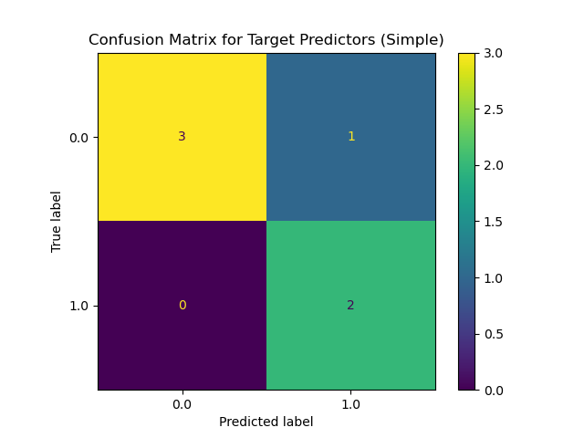
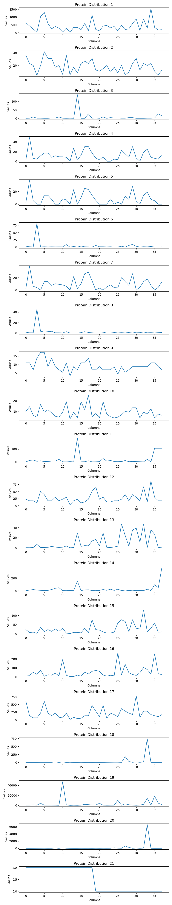
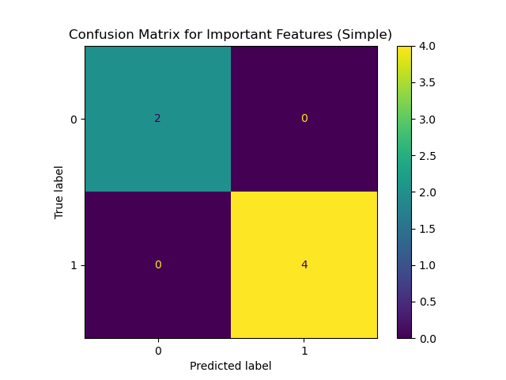
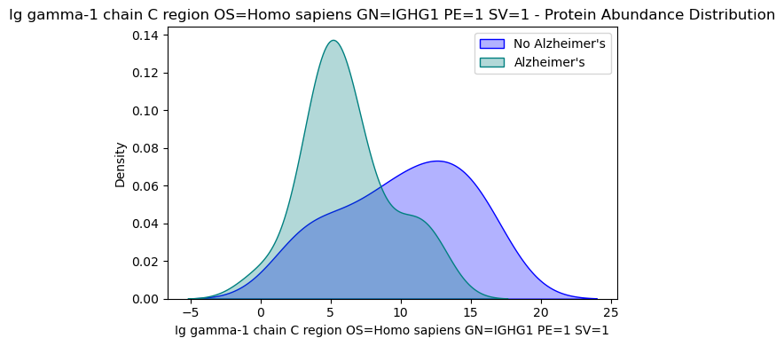
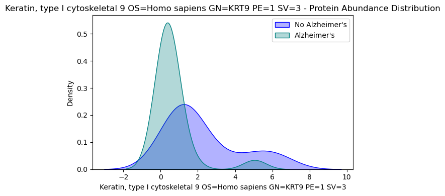
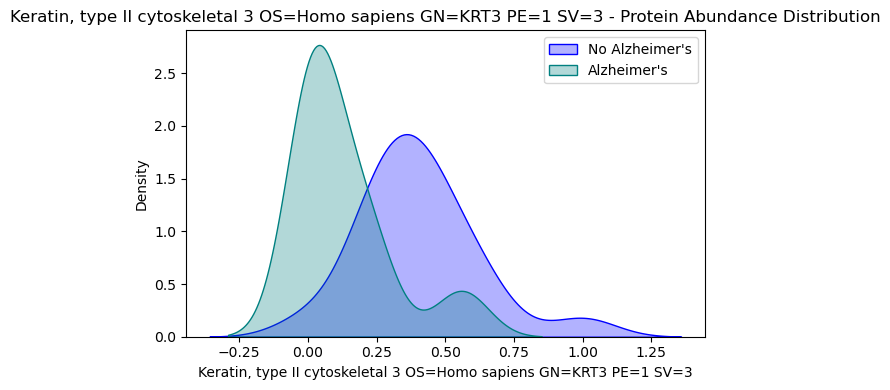

# **Early Stage Exploration for Urine Excreted Biomarkers Importance in  Alzheimer’s Detection** 

## 1.)  Problem Outline:
    
### Problem Statement: 

Alzheimer’s is a highly debilitating neurodegenerative disease responsible for about 70% of all instances of dementia. 
Early detection and treatment is necessary to improve overall quality of life, but currently there is no definitive test to diagnose Alzheimer’s disease. 
There are various tests that assist in the diagnosing process; unfortunately the majority of these tests tend to be inaccessible, invasive, and expensive. 
This project uses datasets of collected urine sample reports from both Alzheimer’s patients and the healthy control group to identify biomarkers for detecting Alzheimer’s demetia from urine and create an early-stage machine learning model that can correctly classify between the two sample groups. Doing so would reduced the pain and cost associated with current testing methods while affording more individuals access to testing.  

### Objectives:

Clean and Process Mass Spectrometry Reports.  
Perform exploratory data analysis (EDA) to identify class variance to set standards.  
Use machine learning algorithms to determine features classification importance.  
Train and evaluate machine learning models to classify between samples.  
Interpret the models/ identify biomarkers for additional study.  

### Datasets:

CSV files: [Molecular Network Analysis of the Urinary Proteome of Alzheimer's Disease Patients](https://repository.jpostdb.org/entry/JPST000475)  

## 2.) Table of Contents:

- Problem Outline
- Table of Contents
- Project Structure
- Data Dictionary 
- Methods
- Results
- Extension
- Citation
- License

## 3.) Project Structure:

1. 01_data 
2. 02_code  
    - 0.5_protein_sequence.ipynb   
    - 01_DataPreprocessing.ipynb    
    - 02_EDA_urine_samples.ipynb  
    - 03_DT_FeatureImportance.ipynb
    - 04_LogRegClassificationModel.ipynb   
3. 03_additional_datasets  
4. 04_images  
    - 3D Protein_Abundance.png  
    - DT_Protein_Feature_Abundance_Distribution.png  
    - Important_Features1.png  
    - Important_Features2.png  
    - Protein_AMBP_Distributions.png  
    - Protein_Density_Plots.png  
    - Protein_Distributions.png  
    - Target_Proteins1.png  
    - Target_Proteins2.png  

## 4.) Data Dictionary:

| **Feature** | **Type** | **Dataset** | **Description** |
| :-----: |:-----: |:-----: |:-----: |
| emPAI Value | Numeric Float | Present within all datasets | An estimate of protein abundance within a sample |
| Prot_desc | String Variable | Present within all datasets | Name of the Specific protein 
| OS | Column Descriptor | Present within all datasets | Organism or Species |
| GN | Column Descriptor | Present within all datasets | Gene Name |
| PE | Column Descriptor | Present within all datasets | Protein | 
| SV | Column Descriptor | Present within all datasets | Serum |
| Alzheimer’s | Binary Numeric | Present within all datasets | Patient sample group |

## 5.) Methods:

#### **The project utilized a multi-stage analytical approach:**

**Data Loading and Preprocessing:**

The Molecular Network Analysis of the Urinary Proteome of Alzheimer's Disease Patients CSV files were processed to extract the emPAI values of proteins present in a individual urine sample. Then the individual samples were the joined together into dataframes.

**EDA:** 

The combined healthy control and alzheimer’s database were formatted, condensed to regions of similarities, and compared between the groups so that patterns could be identified.

**Feature Importance Selection:**

A decision tree was used to classify between the two sample groups with a depth of two. Those features were then ranked in terms of importance for distingushing between the classes. 

**Training Logarithmic Regression:**

Simple a Complex logistic models were trained on both versions of the sample data to guard against overfitting with such small sample size, though the simple and complex models yeilded similar results. 

## 6.) Results:

* The results from the Logistic Regression model shown above demonstrates that our model(s) had a training accuracy score of 93.75 and a testing accuracy score of about 83.33% based on 20 proteins whose mean value had the most variance between the two groups. I decided to use accuracy as the success metric for to answer this problem because it focuses on correctly identifying the diseased condition which directly ties in to diagnosis success criteria. With small subject groups and as a general principle in the field of diagnostics, the 10 point difference between the scores can be expected. When dealing with disease there is no one size fits all approach because everyone is a little different. There may be easier cases to distinguish between in the training group versus the testing. Below is a distribution graph for all 20 proteins while the 21st chart is their group identification of 0 no Alzheimer's or 1 Alzheimer’s. 

* As shown above there isn't a reliable pattern within emPAI values that can easily distinguish between the two groups. While the first model didn't do a terrible job these 20 specific proteins may not be the best focus for urine excreted biomarker test development. 

The results from the Logistic Regression model trained on the Decision Tree derived proteins of interest faired way better

* The Logarithmic model trained on the Decision Tree features had a 100% accuracy rate with testing and 87.5% with the training data. As with the previous model discussed, the small sample size and normal variances within individuals limits our classification ability but the 100% accuracy rate demonstrates a direct correlation between the ratios of these protein estimates in urine and an Alzheimer’s Dementia. Below are the protein abundance graphs seperated between sample groups.

## 7.) Extension:

1. Expand Dataset: Partner with hospitals and other health organizations in an effort to increase the amount and diversity of samples provided.
2. Collect Repeated Samples over the Disease Progression: Collecting samples over the course of time will allow us to study disease progression and better position our model to predict Alzheimer’s disease as early as possible 
3. Incorperate More Information Available from CSV Report: For this project I relied on emPAI values which are estimated ratios based on peptides present using aditional information sources from the mass spectrometry report like molecular charge, amino acid residue, peptide sequence, and peptide variations.
4. Employ Decision Curve Anaylsis and Patient Stratification: Since this dataset didn't provide any demographic data on age or race we can't be sure that certain groups aren't being neglected. 

## 8.) Citation:

[Experimental Datasets](https://repository.jpostdb.org/entry/JPST000475)

[Mascot CSV Header Dictionary](https://mascot.biotech.illinois.edu/mascot/help/csv_headers.html)

[Logistic Regression](https://scikit-learn.org/stable/modules/generated/sklearn.linear_model.LogisticRegression.html)

## 9.) License

This project is licensed under the MIT License - see the LICENSE file for details.